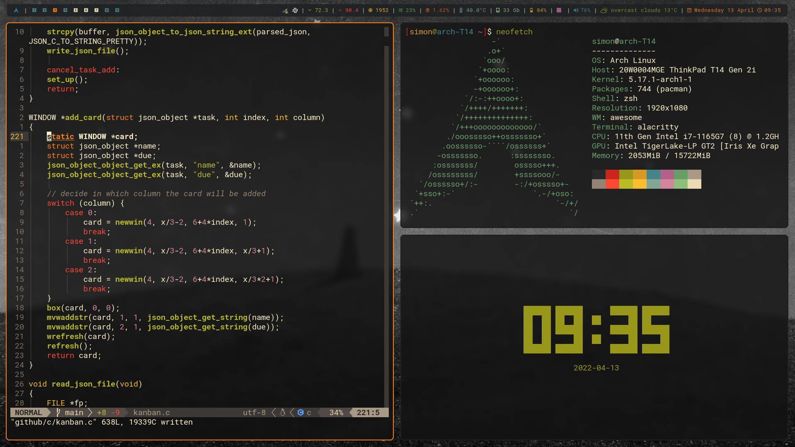

# Welcome ~/

This repository contains my personal Linux dotfiles.  
They are often (speak: all the time) a work in progress and may or may not work for you.  
I recently switched from X11 to Wayland using the [River](https://github.com/riverwm/river) compositor.


<details>
  <summary>Screenshot for AwesomeWM (Same but different)</summary>

  
</details>

## Dependencies

Some of these are not hard dependencies and can be changed in the config files. This is more of a list for me.  
Install with `pacman -S --needed <PACKAGE>`.

Packages used for these dotfiles (in no particular order):
```
wayland polkit waybar zsh zsh-syntax-highlighting network-manager-applet zathura zathura-pdf-poppler wl-clipboard xdg-desktop-portal xdg-desktop-portal-wlr swaybg pipewire wireplumber pipewire-alsa pipewire-jack helvum mpd mpc ncmpcpp grim swaylock mako kitty brightnessctl reflector exa bat duf neovim capitaine-cursors neofetch pcmanfm-gtk3 firefox firefox-tridactyl
```

Other Packages I use:
```
ack grep alsa-utils biber texlive-most perl-clone flake8 nmap ntfs-3g openbsd-netcat powertop ruby-rouge tig tree traceroute ufw zip unzip wget wireshark-cli networkmanager-openvpn mesa gvfs sed udisks2 dosfstools ntfs-3g dnsutils net-tools asciidoctor gzip htop openssh sshpass rsync tlp udiskie
```

AUR Packages
```
river rofi-lbonn-wayland wdisplays librewolf-bin nerd-fonts-roboto-mono ctpv-git qview
```

The configs for `awesome`, `picom`, `alacritty` and `moc` are outdated, it you want to use then, make sure to install these packages as well.
```
awesome alacritty rofi slock flameshot picom-git (AUR) moc-pulse (AUR)
```

## Installation

Clone the repo into your home directory.

```sh
git clone https://github.com/sihensel/dotfiles.git
```

There is no wallpaper included, the window manager looks for `~/wallpapers/wall.jpg`.  
This can be configured in [theme.lua](awesome/themes/groovebox/theme.lua#L42) for awesome or [process.sh](river/process.sh) for river.

### Install Script

The script `install.sh` places symlinks to the local repo, so all files can stay in one place.  
You might want to ignore that, this is just for my personal setup.

```sh
./install.sh   # or
./install.sh -p /path/to/dotfiles/
```

## Configure Neovim Plugins

The keybinds are listed in [init.vim](nvim/init.vim).
Run `:PlugInstall` in Neovim to install all plugins. `nodejs` and `npm` are required for `coc`. Langauge server packs can be installed with e.g.:

```sh
CocInstall coc-pyright coc-sumneko-lua coc-json coc-clangd coc-cmake
```
Check [the docs](https://github.com/neoclide/coc.nvim/wiki/Using-coc-extensions) and the [install guide](https://github.com/neoclide/coc.nvim/wiki/Install-coc.nvim) for more info.

Install the following packages with your package manager:
```
fd ripgrep fzf jq glow
```

## Firefox userChrome.css

This theme is heavily based on [Dook97's](https://github.com/Dook97/firefox-qutebrowser-userchrome) config with a few additions.
It is intended to use with the [tridactyl](https://github.com/tridactyl/tridactyl) extension (Install the `firefox-tridactyl` package for Arch, and restart Firefox _twice_).

Go to `about:config`:
1. set `toolkit.legacyUserProfileCustomizations.stylesheets` to `true`
2. set `browser.compactmode.show` to `true`
3. also set `extensions.pocket.enabled` to `false` while we're at it

Go to the `Customize Toolbar` menu (under `More Tools`) and set `density` to `compact`.  
Enable a dark theme in the settings, I use [this Gruvbox theme](https://addons.mozilla.org/en-US/firefox/addon/gruvbox-dark-theme/).  
Copy the `userChrome.css` to the `chrome` directory in your firefox profile. If there is none create it.  
Check `about:profiles` for the path to your profile.

The navbar can be opened with `CTRL+L`.

When using Librewolf (or any other Firefox fork I guess), install the `tridactyl` extension from their Github repo.

## Slack Theme

Gruvbox Slack theme. Paste into `Preferences` > `Themes`.
```
#282828,#3c3836,#D65D0E,#1D2021,#504945,#FBF1C7,#83C07C,#fb4934,#282828,#FBF1C7
```

## Pacman Hook

Make sure to install the `pacman-contrib` package, then copy the file to `/etc/pacman.d/hooks`.

```sh
sudo cp clear_cache.hook /etc/pacman.d/hooks
```

## Miscellaneous

Make sure to create the directory for MPD playlists.
```sh
mkdir -p ~/.config/mpd/playlists
```

### Enable screen sharing

For Chrome, visit `chrome://flags/#enable-webrtc-pipewire-capturer` and `chrome://flags/#ozone-platform-hint`.  
Also, install the `libpipewire02` package.  
Start Chrome with `google-chrome-stable --enable-features=UseOzonePlatform --ozone-platform=wayland`.

Start Slack with: `slack --enable-features=WebRTCPipeWireCapturer`.
